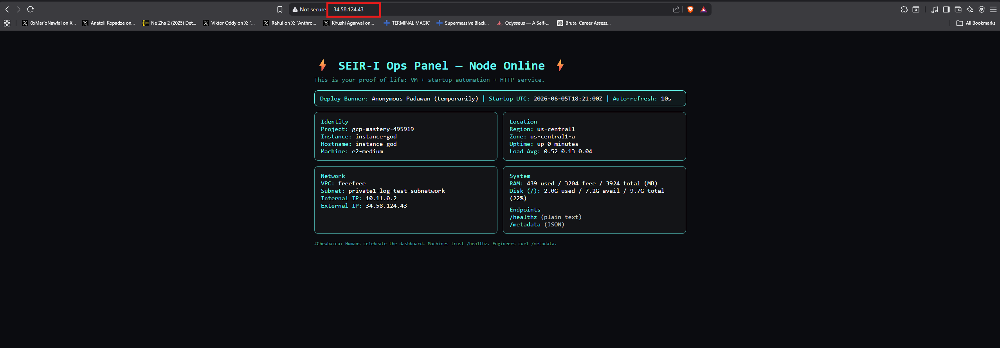
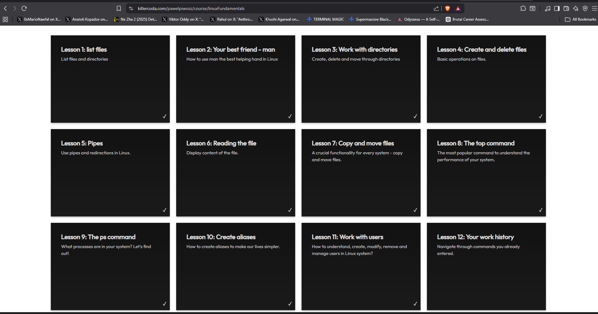

# Homework Week 5 — Terraform IVPAD Evidence and Google Cloud Practice

## Overview

This folder contains Homework Week 5 evidence for Terraform practice, Google Cloud deployment validation, Linux/Git study progress, and class lab execution.

The main focus of this assignment is the **Terraform IVPAD sequence**:

```text
I — terraform init
V — terraform validate
P — terraform plan
A — terraform apply
D — terraform destroy
```

This submission also includes the required command verification:

```bash
date && hostname && whoami
```

The `data.md` file contains command output evidence captured from the Terraform run.

---

## Table of Contents

- [Overview](#overview)
- [Weekly Study Requirements](#weekly-study-requirements)
- [Class Practice Task](#class-practice-task)
- [Deliverables Checklist](#deliverables-checklist)
- [Evidence Files](#evidence-files)
- [Terraform IVPAD Commands](#terraform-ivpad-commands)
- [Screenshots](#screenshots)
- [Extra Credit Reference](#extra-credit-reference)
- [Folder Structure](#folder-structure)
- [Submission Notes](#submission-notes)

---

## Weekly Study Requirements

### Udemy

| Training | Required Sections |
|---|---|
| Masterclass | Sections 5–6 |

### Books

| Source | Required Reading |
|---|---|
| Packt | Chapters 1–4 and Chapter 8 |
| Terraform | Chapters 1–2 |
| TLCL Linux | Chapters 1–4 |
| KCLinux | Lessons 1–8 |
| LG Git | Chapters 1–3 |
| KCG Git | Lessons 1–4 |

---

## Class Practice Task

The class practice task was to re-run the in-class Terraform lab from Friday and Saturday recordings and capture screenshots during the full Terraform workflow.

Required workflow:

1. Run `terraform init`
2. Run `terraform validate`
3. Run `terraform plan`
4. Run `terraform apply`
5. Run `terraform destroy`
6. Confirm teardown
7. Run:

```bash
date && hostname && whoami
```

---

## Deliverables Checklist

| Requirement | Status | Evidence Location |
|---|---:|---|
| `main.tf` and/or split Terraform files | ✅ Complete | Current folder |
| Terraform plan output saved as `plan.txt`, `.txt`, `.json`, or evidence file | ✅ Complete | `data.md` |
| Terraform apply proof | ✅ Complete | `terraform apply.png` |
| Terraform destroy proof | ✅ Captured in command evidence | `data.md` |
| `date && hostname && whoami` output | ✅ Captured in command evidence | `data.md` |
| VM URL proof showing homepage on port 80 | ✅ Complete | `website.png` |
| Linux study evidence | ✅ Complete | `linux.png` |
| Section 6 and 7 training evidence | ✅ Complete | `section 6 & 7.png` |

---

## Evidence Files

### `data.md`

The `data.md` file contains Terraform command output captured from the CLI using JSON output redirection.

The command sequence used:

```bash
terraform init -json >> data.md
terraform validate -json >> data.md
terraform plan -json >> data.md
terraform apply -auto-approve -json >> data.md
terraform destroy -auto-approve -json >> data.md
```

This file acts as the command-output evidence record for the Terraform workflow.

---

## Terraform IVPAD Commands

### 1. Terraform Init

```bash
terraform init
```

Initializes the Terraform working directory, downloads provider plugins, and prepares the backend.

### 2. Terraform Validate

```bash
terraform validate
```

Validates the Terraform syntax and confirms that the configuration is structurally valid.

### 3. Terraform Plan

```bash
terraform plan
```

Generates the proposed infrastructure changes before deployment.

Optional evidence export:

```bash
terraform plan > plan.txt
```

or JSON-style evidence:

```bash
terraform plan -json >> data.md
```

### 4. Terraform Apply

```bash
terraform apply -auto-approve
```

Deploys the infrastructure to Google Cloud.

### 5. Terraform Destroy

```bash
terraform destroy -auto-approve
```

Tears down the infrastructure and removes the provisioned cloud resources.

### 6. Local System Verification

```bash
date && hostname && whoami
```

Confirms the local execution environment after the Terraform workflow is complete.

---

## Screenshots

### Terraform Apply Proof


---

### VM Homepage Proof on Port 80



---

### Linux Study Evidence



---

### Section 6 and 7 Training Evidence


---

## Extra Credit Reference

The extra credit task requires exporting Terraform plan output into a file, moving it into a dated homework folder, and pushing the evidence to GitHub.

Suggested command flow:

```bash
terraform plan > plan.txt

mkdir "$(date +%Y-%m-%d)_weekB_hw"

mv plan.txt "$(date +%Y-%m-%d)_weekB_hw/"

cd "$(date +%Y-%m-%d)_weekB_hw"

git init
git add .
git commit -m "Add Terraform plan output for Week B homework"
```

The GitHub repository name should start with:

```text
TheoU_7.5_BaM_weekB
```

---

## Folder Structure

```text
Homework Week 5/
├── .terraform/
├── .terraform.lock.hcl
├── 0-userdata.sh
├── 1-main.tf
├── 2-var.tf
├── 3-output.tf
├── data.md
├── info.sh
├── linux.png
├── README.md
├── section 6 & 7.png
├── terraform apply.png
├── terraform.tfstate
├── terraform.tfstate.backup
└── website.png
```

---

## Submission Notes

This Homework Week 5 folder documents the Terraform workflow, training progress, command evidence, and screenshot proof required for submission.

The deployment evidence is stored in:

```text
data.md
terraform apply.png
website.png
linux.png
section 6 & 7.png
```

The Terraform files in this folder represent the infrastructure used for the class practice lab.
